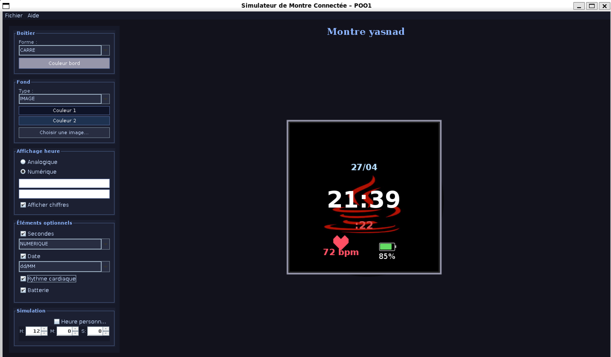

# ⌚ Projet Montre Connectée Personnalisable en Java

Application Java développée dans le cadre du module de Programmation Orientée Objet (POO), permettant de concevoir, personnaliser et simuler une montre connectée interactive grâce à une interface graphique réalisée avec Swing.

---

## 🎯 Objectif du projet

Créer une montre virtuelle entièrement configurable en appliquant les principes fondamentaux de la programmation orientée objet :

- Héritage
- Polymorphisme
- Encapsulation
- Abstraction
- Sérialisation Java
- Interface graphique (Swing)

---
## 📸 Aperçu de l'application




## ✨ Fonctionnalités principales

### 🕒 Affichage de l’heure :
- Mode analogique
- Mode numérique
- Simulation d’heure personnalisée
- Affichage des secondes :
  - Trotteuse
  - Mini-cadran
  - Numérique

### 🎨 Personnalisation :
- Forme du boîtier :
  - Rond
  - Carré
  - Arrondi
- Couleurs du boîtier
- Fond du cadran :
  - Uniforme
  - Dégradé
  - Image personnalisée
- Personnalisation des aiguilles

### 📅 Éléments optionnels :
- Date
- Batterie
- Rythme cardiaque
- Secondes

### 💾 Gestion avancée :
- Création de nouvelles montres
- Sauvegarde de configuration
- Chargement de montres sauvegardées
- Sérialisation complète des objets

---

## 🏗️ Architecture du projet

```text
src/
└── montre/
    ├── modele/
    │   ├── Montre.java
    │   ├── ElementMontre.java
    │   ├── Boitier.java
    │   ├── FondCadran.java
    │   ├── AffichageHeure.java
    │   ├── AffichageAnalogique.java
    │   ├── AffichageNumerique.java
    │   ├── ElementDate.java
    │   ├── ElementSecondes.java
    │   ├── ElementBatterie.java
    │   └── ElementRythmeCardiaque.java
    │
    ├── vue/
    │   ├── FenetreMontre.java
    │   ├── PanneauMontre.java
    │   └── PanneauConfig.java
    │
    └── serialisation/
        └── GestionnaireMontre.java
